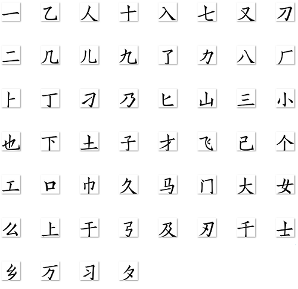
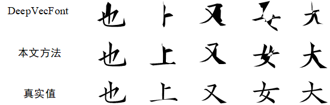

# ChineseVecFont

本研究为矢量到矢量、端到端的汉字字体生成方法，可以提高字体生成质量和生成效率。

## Demo 
数据集（52个字体字体）:



本方法合成的矢量字体示例：




## Installation

### Requirement

- **python 3.9**
- **Pytorch 1.9** 

使用 Anaconda 创建环境:
```shell
conda create -n dvf python=3.9
source activate dvf
```
安装 pytorch 通过这个[说明](https://pytorch.org/get-started/locally/)

### Install diffvg

在测试阶段，使用diffvg来优化生成的矢量符号，https://github.com/BachiLi/diffvg 有安装说明


## Data and Pretrained-model

## Training and Testing

训练模型，运行以下指令
```
python main.py --mode train --experiment_name dvf --model_name main_model
```
全局变量的设置在 `options.py` 中.

测试模型，运行以下指令
```
python test_sf.py --mode test --experiment_name dvf --model_name main_model --test_epoch 1500 --batch_size 1 --mix_temperature 0.0001 --gauss_temperature 0.01
```
要细化矢量符号，请运行
```
python refinement.mp.py --experiment_name dvf --fontid 14 --candidate_nums 20 
```
可以对神经光栅化和图像超分辨率模型进行预训练；

训练神经光栅化器:
```
python train_nr.py --mode train --experiment_name dvf --model_name neural_raster
```
训练图像超分辨率模型:
```
python train_sr.py --mode train --name image_sr
```

## Customize your own dataset

- **准备 ttf/otf 文件**

把 ttf/otf 文件放在 `./data_utils/font_ttfs/train` 和 `./data_utils/font_ttfs/test`中, 然后将它们编号 `0000.ttf`, `0001.ttf`, `0002.ttf`...

- **安装Fontforge**

python > 3.0:
```
conda deactivate
apt install python3-fontforge
```

- **通过 Fontforge 获得 SFD 文件**
```
cd data_utils
python convert_ttf_to_sfd_mp.py --split train
python convert_ttf_to_sfd_mp.py --split test
```

- **生成字形图像**
```
python write_glyph_imgs.py --split train
python write_glyph_imgs.py --split test
```

- **打包为 pkl 文件**
```
python write_data_to_pkl.py --split train
python write_data_to_pkl.py --split test
```
## Acknowledgment

[deepvecfont](https://github.com/lixinjie97/deepvecfont)
